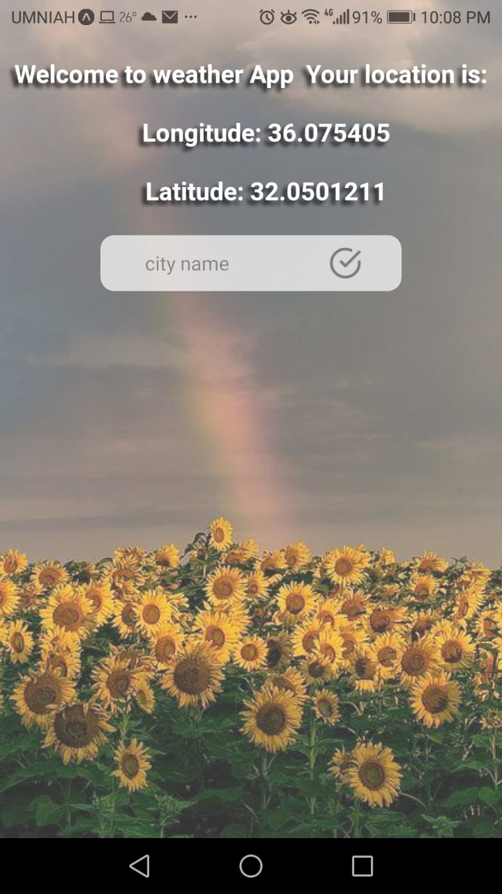
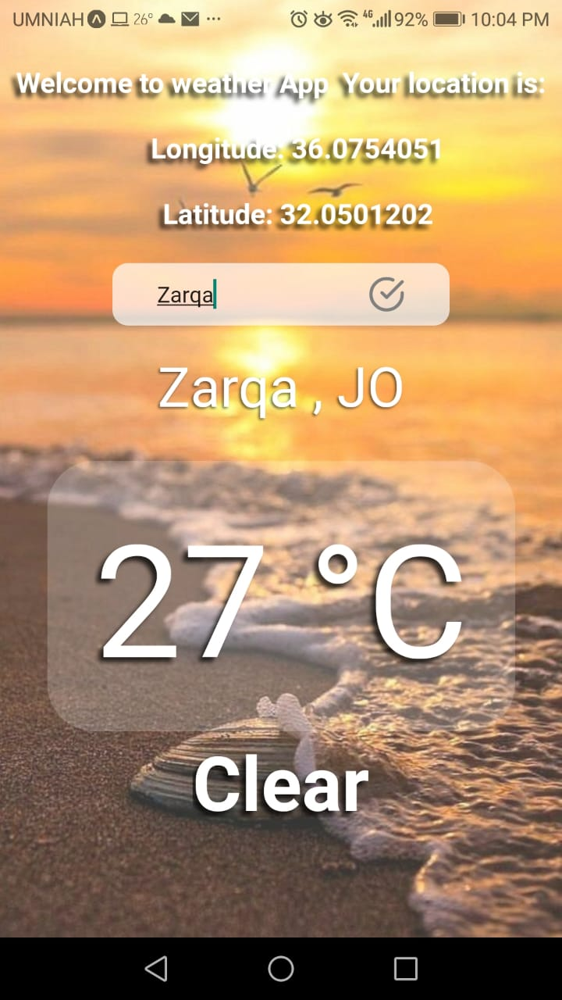
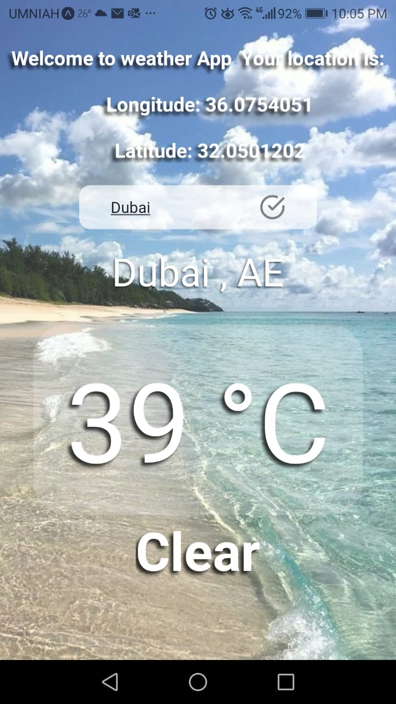
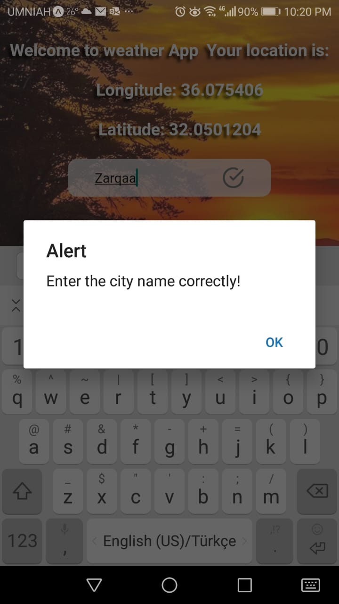

# Weather-app

- This application  allows you to get the weather information for any city in the world just by searching for it 
- You can get your exact location if you agree on location permission

---
1) First thing it will ask for give a permission to access your location

---
2)  When you press to allow the app will give you your current location

---

3) you can search for weather information neither if you give a location permission or not by just tapping the city name in the text input  and the weather information will be shown 

- This app will randomly show different awesome background with each click

---
4) if you insert incorrect city name the alert massage  will be shown

